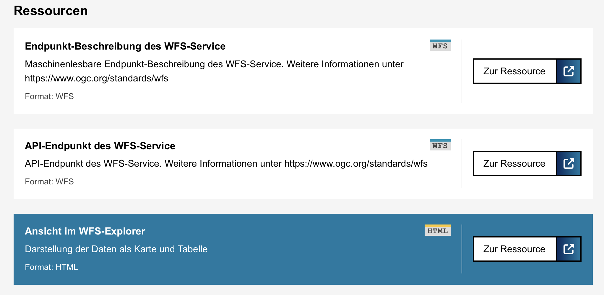

# Adding a New Virtual Resource

A virtual resource is a resource that is not actually a resource in the dataset's metadata, but one that gets added to the output page, based on some heuristics.
A virtual resource would be a link that is helpful to end users, but not actually part of the data.
An example is the WFS-explorer link that can be added automatically to all WFS datasets.



The following steps are necessary for adding a virtual resource:

## Helper Function

Define a function that determines whether or not to add the resource.
The example for the WFS explorer in [ckanext/datasetsnippets/helpers.py](ckanext/datasetsnippets/helpers.py):

```python
def wfs_endpoint_for_dataset(dataset_dict: dict) -> str:
  '''Returns the WFS endpoint for a dataset. If the dataset is not a WFS,
  or doesn't have a resource that looks like an API endpoint, return `None`.'''
  for resource in dataset_dict['resources']:
    # --- this part needs custom logic
    if resource.get('format') and resource['format'].upper() == "WFS":
      if resource.get('internal_function') == 'api_endpoint':
    # ---
        if resource.get('url'):
          return resource['url']
  return None
```

The helper function needs to be registered in order to be available in a template:

See [ckanext/datasetsnippets/plugin.py](ckanext/datasetsnippets/plugin.py):

```python
def get_helpers(self):
  return {
    …
    'berlin_unique_resource_formats': theme_helpers.unique_resource_formats ,
    'berlin_wfs_endpoint_for_dataset': theme_helpers.wfs_endpoint_for_dataset , <---
  }
```

## Unit Test Helper Function

The function should be unit tested.
See [test_helpers.py/test_wfs_endpoint_for_dataset()](ckanext/datasetsnippets/tests/test_helpers.py) for a unit test with various configurations for good and bad input.

## Generate Markup

Markup for the virtual resource gets generated in the [resources_list.html](ckanext/datasetsnippets/templates/datasetsnippets/snippets/resources_list.html) template:

```jinja

  
  
    
  

```

